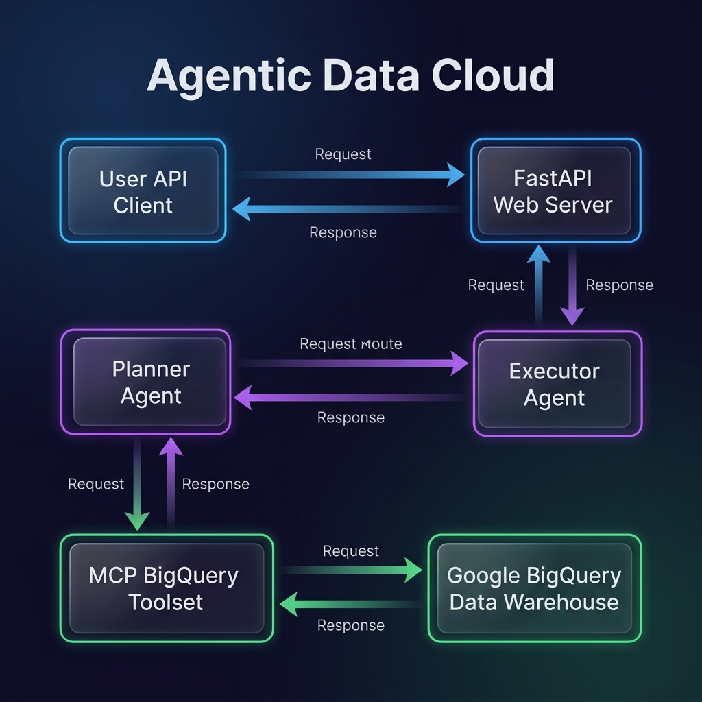

# Walkthrough: Agentic Data Cloud Demo

Welcome! This guide explains how this Multi-Agent Mesh dynamically discovers schemas and queries database tables in BigQuery without any hardcoded database parameters.

---

## 1. High-Level Architecture Diagram

Here is how the data and agent interactions flow when a user submits a query:



---

## 2. Core Concepts Explained

### A. Dynamic Catalog Discovery (No Hardcoding)
Traditional database apps hardcode table names (e.g., `SELECT * FROM my_dataset.my_table`). 
In an **Agentic Data Cloud**:
* The database schema is treated as a dynamic black box.
* The agent lists datasets, lists tables, and inspects schemas dynamically at runtime before writing a single line of SQL.

### B. Multi-Agent Mesh
To execute safely, the task is split between two specialized roles:
1. **The Planner Agent**: Act as the "analyst". It receives the user's question and creates a step-by-step schema discovery plan. It *does not* write SQL or execute tools.
2. **The Executor Agent**: Act as the "operator". It takes the plan and runs the tools in sequence (list datasets $\rightarrow$ list tables $\rightarrow$ fetch schema $\rightarrow$ run query).

### C. Model Context Protocol (MCP)
Instead of embedding custom Python code or database drivers (which present security and prompt injection risks), the agents communicate via **MCP**. This separates the LLM reasoning from the database execution environment.

---

## 3. Step-by-Step Flow

When user asks: *"What is the total revenue for transactions that were delayed in Q1?"*

```
[User Input]
       │
       ▼
[Planner Agent] ────► Formulates Plan:
       │              1. List datasets in project
       │              2. Find table in sandbox dataset
       │              3. Check schema of table
       │              4. Query total revenue where status is DELAYED
       ▼
[Executor Agent] ───► Runs MCP Tool calls:
       │              ├── list_dataset_ids() ─────► Found 'adk_enterprise_sandbox'
       │              ├── list_table_ids() ───────► Found 'q1_transaction_logs'
       │              ├── get_table_info() ───────► Columns: revenue, status, etc.
       │              └── execute_sql_readonly() ─► Runs SELECT SUM(revenue) ...
       ▼
[Final Output]  ────► "The total revenue for transactions that were delayed in Q1 is $850.00."
```

---

## 4. Key points to note
1. **Lack of hardcoding**: Open `agents_mesh.py` and see that the terms `adk_enterprise_sandbox` or `q1_transaction_logs` are completely absent.
2. **Run `adk web .`**: Open the Web UI and run the query live. The session log will render each tool step visually.
3. **Adaptation**: If you seed a brand-new dataset or add columns, this exact same agent code will dynamically adjust without a redeploy.
4. **Security**: The agent uses Google's ambient identity and only reads data using MCP tools. No hardcoded SQL, no prompt injection risks.
